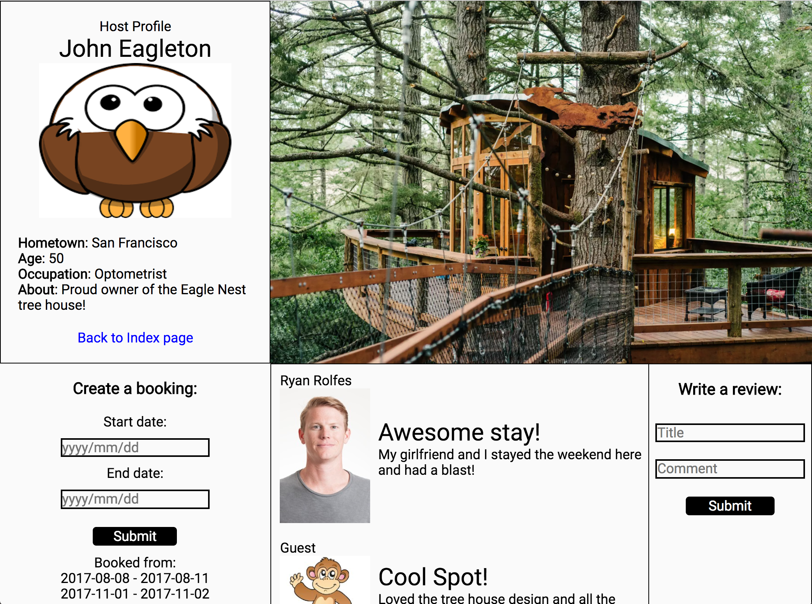

# TreeSurfing
[Live](http://treesurfing.herokuapp.com/)

CodeBlocks is a web application that enables users to search for and book stays at tree houses all over the world. It was built using Java Script, Ruby on Rails, React/Redux, and PostgreSQL.

The entire project was conceived, designed, and completed in a strict two-week timeframe, with the potential for future enhancement.

## Technologies

Rails was used for the backend development of this project to handle data fetching and storage with a connection to a PostGreSQL database. Rails is a powerful tool that can be implemented with a simple RESTful API. The front end application was written using javascript's React library for reusable, modular code. It was used in conjunction with the Redux framework to add in the benefits of a unidirectional data flow which made the application easier to debug.

## Features & Implementation
### Searching the World for Tree Houses

The world is a big place with many different incredible places to visit and experience. For treehouse aficionados, it can be very difficult to find locate a potential tree house to stay in. Tree Surfing's moveable map feature helps users discover their options all over the world. Instead of having to pick a city and then research what tree houses are available in that area, one can simply move the map and the index of available tree houses updates in real - all according to location. Thus, the map feature alleviates the headache that accompanies traditional guess and check searching of different regions across the globe.

There were many challenges with implementing the movable map. First and foremost was determining what information to retrieve from the map and how to use that information to update the tree house index accordingly.

Ultimately, the database was designed to require each tree house to contain its coordinates. The an event listener and the google maps API were used to retrieve the northeastern and southwestern bounds of the map. Once the bounds were received, an ajax request was make to retrieve all the tree houses with in the maps bounds. Finally, the updated state would trigger a re-render of the tree houses index and the index would populate with the available listings in the specified area. Seamlessly and in real time.

### Searching the World for Tree Houses

The aforementioned index page is a collection of clickable photos that redirect to each tree houses individual show page. This page allows users to easily see the tree house's availability and book stays by entering his or her desired dates. Other bookings are shown on the page. Unlike other travel sites, Tree Surfing encourages meeting new people by staying together in tree houses. This is comparable to Couch Surfing allowing multiple guests.

Additionally, users can see the host's profile and information. Finally, users can leave comments about the treehouse and see other comments from previous visitors. 
